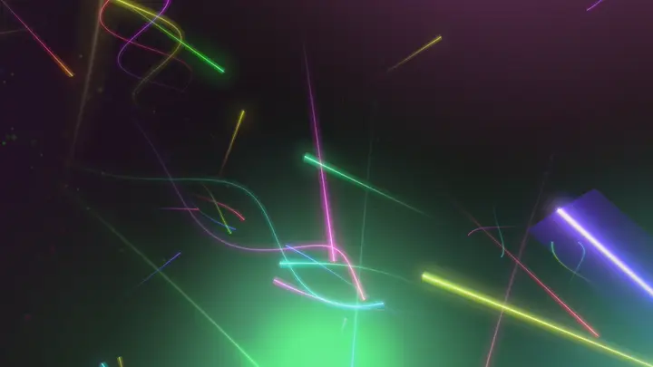

# nebulights

A screensaver for Wayland compositors, in the spirit of Sergio Duarte's
*Voodoo Lights*, the 3dfx-era screensaver from the early 2000s.

*[Polski](README.pl.md)*

The viewer sits still at the centre of mass and only turns their gaze.
Glowing objects orbit around, each dragging a ribbon that fades and
dissolves into mist. Some fly in pairs and triples, spiralling around
each other. Some shed sparks, others steam. Every now and then one
detonates and respawns somewhere else, always off-screen.

It needs a compositor that supports `wlr-layer-shell-unstable-v1` and
`ext-idle-notify-v1`. Tested on niri and KDE Plasma; Hyprland, Sway
and river should work too.

## Install

From source:

    # Arch: pacman -S --needed base-devel wayland libglvnd
    make
    sudo make install          # -> /usr/local/bin/nebulights

Build dependencies: `wayland` (client, egl, scanner), EGL and GLESv2
(`libglvnd` + a Mesa driver). `libsystemd` is optional, see
[Starts during a video](#starts-during-a-video).

## Usage

    nebulights                 # start after 5 min of idle
    nebulights -t 120          # ...after 2 min
    nebulights --now           # start right away, exit on input
    nebulights -I              # ignore idle inhibitors

Any key or mouse movement ends it. **It is not a screen locker and
protects nothing**; use `swaylock`, `hyprlock` or your desktop's locker
for that.

It must fire before the compositor turns the monitors off or locks
the screen, so set those timeouts longer than `-t`. Once monitors are
off, the compositor stops handing out frames and nebulights stops
rendering by itself.

With several monitors there is still one camera: each monitor shows its
own slice of the view, arranged as in the compositor's output layout,
so a ribbon leaving one screen enters the next.

### systemd user service

Works with any session that starts `graphical-session.target` (niri,
Plasma, Hyprland with uwsm, ...):

    systemctl --user enable --now nebulights.service

The unit is installed by the package and by `make install`. Change the
timeout with `systemctl --user edit nebulights.service`.

### niri

    spawn-at-startup "nebulights" "-t" "300"

### Hyprland

    exec-once = nebulights -t 300

or through `hypridle`:

    listener {
        timeout = 300
        on-timeout = nebulights --now
    }

### KDE Plasma

Plasma has no screensaver framework, only a screen locker, so there is
no settings panel to plug into. Run the service (or copy
`contrib/nebulights.desktop` to `~/.config/autostart/`) and set
*Power Management → Turn off screen* and *Screen Locking → Lock after*
to more than `-t`. The Plasma lock screen appears on top of nebulights
and takes the keyboard, which is correct.

## Configuration

`$XDG_CONFIG_HOME/nebulights.conf` (usually `~/.config/nebulights.conf`).
Format `key value`, `#` starts a comment. No file means defaults. Every
key is described in [`nebulights.conf.example`](nebulights.conf.example).

The most visible one:

    palette 2      # 0 = rainbow, 1 = gruvbox, 2 = nostromo

### Checking that it starts

Shorten the timeout and leave the mouse alone:

    systemctl --user stop nebulights    # so two copies don't fight
    nebulights -t 10

It reports what it does:

    nebulights: waiting for 10 s of idle
    nebulights: screensaver on (1 output)
    nebulights: screensaver off after 6 s

If the compositor lacks a required protocol, it says so and exits.

### Starts during a video

Idle inhibition on Linux goes two ways: Wayland's
`idle-inhibit-unstable-v1` and D-Bus `org.freedesktop.ScreenSaver`.
`ext-idle-notify-v1` only respects the first one, while browsers and
some players use the second.

So nebulights also asks PowerDevil (`HasInhibition`), which collects
both. This needs `libsystemd` at build time and only helps on Plasma;
elsewhere D-Bus inhibitors stay invisible, and the program says so once
at startup. To start regardless, use `-I`.

### Stuttering

Run with the frame meter:

    NEBULIGHTS_STATS=1 nebulights --now

Every 5 seconds it prints frame rate, average and worst frame time, and
counts of what is being drawn. The bottleneck is pixel fill, not the CPU
(the simulation takes about 2 ms). Knobs, most effective first:

| key | default | note |
|---|---|---|
| `nebula_size` | 1.8 | cost grows with the **square** |
| `nebula_puffs` | 2400 | cost grows linearly |
| `bloom_levels` | 2 | `1` drops the wide halo, `0` all glow |
| `objects` | 100 | cast size in percent |
| `sample_step` | 0.07 | higher = fewer vertices, angular turns |
| `half_float` | 1 | `0` saves bandwidth at the cost of HDR |

For power rather than speed: `fps_cap 30` looks the same and keeps the
GPU cool through the night.

## How it works

    src/main.c     Wayland, layer-shell, ext-idle-notify, EGL
    src/scene.c    simulation and rendering (GLES2)
    src/inhibit.c  D-Bus inhibitor check (optional)
    preview.html   the same scene in WebGL, for tuning without recompiling

`scene.c` knows nothing about Wayland, `main.c` nothing about the
simulation.

**Motion.** Softened point gravity with the attractor at the viewer. The
camera never moves; if it did, the attractor would move with it and the
orbits would stop being orbits. The softening causes slow precession, so
a path never repeats. Periapsis has a forced minimum, otherwise objects
would fly through the lens.

**Ribbons.** Trails sampled at a fixed distance, facing the camera.
Geometry is built once per frame and drawn twice: wide and dim for the
glow, narrow and bright for the core.

**Glow.** Half-float buffer when the hardware allows, bright-pass, and a
separable blur on two levels: quarter resolution for the tight glow,
eighth for the wide halo with channel split.

## Tests

    gcc -O2 -std=c11 -Isrc -o test/fast src/scene.c test/glstub.c \
        test/harness.c -lm
    ./test/fast 30          # 30 minutes of simulation without a GPU

`test/glstub.c` stubs GLES2 and reads the whole declared range of every
buffer, so `-fsanitize=address` catches overruns.

## About the code

nebulights was written by an AI (Claude, by Anthropic) under my
direction: I set the goal and the look, tested it on my hardware and
reported what was wrong, round after round. I did not write the code
myself, and I want that to be clear up front.

## License

[MIT](LICENSE)
